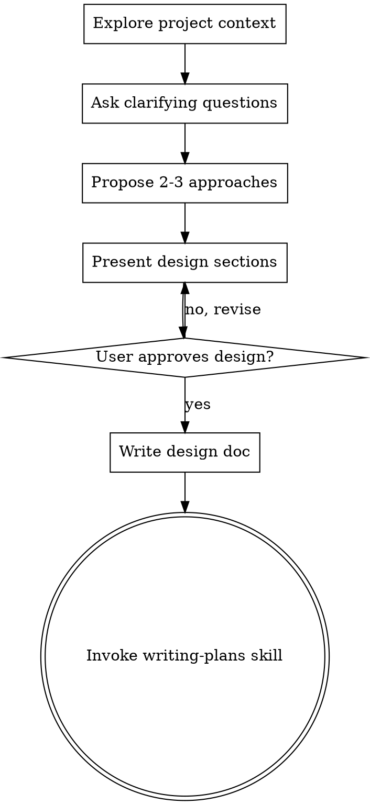

# Brainstorming Ideas Into Designs

## Overview

Help turn ideas into fully formed designs and specs through natural collaborative dialogue.

Start by understanding the current project context, then ask questions one at a time to refine the idea. Once you understand what you're building, present the design and get user approval.

<HARD-GATE>
Do NOT invoke any implementation skill, write any code, scaffold any project, or take any implementation action until you have presented a design and the user has approved it. This applies to EVERY project regardless of perceived simplicity.
</HARD-GATE>

## Anti-Pattern: "This Is Too Simple To Need A Design"

Every project goes through this process. A todo list, a single-function utility, a config change — all of them. "Simple" projects are where unexamined assumptions cause the most wasted work. The design can be short (a few sentences for truly simple projects), but you MUST present it and get approval.

## Checklist

You MUST create a task for each of these items and complete them in order:

1. **Explore project context** — check files, docs, recent commits
2. **Ask clarifying questions** — one at a time, understand purpose/constraints/success criteria
3. **Propose 2-3 approaches** — with trade-offs and your recommendation
4. **Present design** — in sections scaled to their complexity, get user approval after each section
5. **Write design doc** — save to `docs/plans/YYYY-MM-DD-<topic>-design.md` and commit
6. **Transition to implementation** — invoke writing-plans skill to create implementation plan

## Process Flow

**The terminal state is invoking writing-plans.** Do NOT invoke frontend-design, mcp-builder, or any other implementation skill. The ONLY skill you invoke after brainstorming is writing-plans.

## The Process

**Understanding the idea:**
- Check out the current project state first (files, docs, recent commits)
- Ask questions one at a time to refine the idea
- Prefer multiple choice questions when possible, but open-ended is fine too
- Only one question per message - if a topic needs more exploration, break it into multiple questions
- Focus on understanding: purpose, constraints, success criteria

**Exploring approaches:**
- Propose 2-3 different approaches with trade-offs
- Present options conversationally with your recommendation and reasoning
- Lead with your recommended option and explain why

**Track-Specific Approach Generation:**

**ML context** (building/training models, running experiments):
- Propose **3+ approaches**: (1) standard/strong baseline, (2) scaling/systems-optimized, (3) non-obvious/cross-domain idea (even if risky)
- For each approach: list **key assumptions**, **failure modes** + how they appear in metrics/logs, **cheapest test/ablation** to validate quickly
- Include a **de-risking strategy**: what's the minimalist version that proves the approach in < 60 seconds? If a run would take > 2 minutes, find a proxy that finishes in under 1 minute
- **Correctness checklist** (surface in design, required before full run): dataset sanity check, shape/dtype assertions, determinism (fix seed), single-iteration test (1 step end-to-end), overfit-a-small-batch (loss → near 0)
- **Experiment structure**: clarify whether this is a new experiment (different question → new directory + JOURNAL.md) or a new run (same question, tweaks → new run under `runs/` named `YYYY-MM-DDTHH-MM-SS-<slug>`)
- **Journal-first discipline**: before each next step read JOURNAL.md; record observations, anomalies, hunches with tags `[WEIRD]`, `[HUNCH]`, `[TODO]`, `[RESOLVED]`
- **Reproducibility**: seeds, hyperparameters, and config diffs between runs go in JOURNAL.md; git commit before each significant run

**DS/Analysis context** (analyzing data for decisions):
- **Frame the problem first:** What decision? What lever? What metric? Counterfactual? Constraints? If the user skips framing, push back — a well-framed question is worth more than a sophisticated model on the wrong problem
- Propose **3+ analytical angles**: (1) descriptive/exploratory, (2) standard inferential/predictive, (3) non-obvious/cross-domain (causal inference, simulation, Bayesian, information-theoretic)
- Generate 8-12 candidate approaches → narrow to 3-5 for deep evaluation with trade-offs
- Include **risk register**: top 5 ways the analysis could produce wrong or misleading conclusions, with early-detection signals and mitigations
- **Statistical rigor** (required in design): effect sizes + confidence intervals over bare p-values; state multiple comparisons correction method if >1 hypothesis; include power analysis; audit assumptions for each test/model
- **Session structure**: each analysis lives in `analysis/YYYY-MM-DDTHH-MM-SS-<slug>/` with `journal.md` (append-only), `plots/`, and `scripts/`; all plots saved as WebP
- **Ask-why discipline**: before each plot or table, ask what decision or question it serves; one step at a time, suggest the next step and wait for confirmation

**SW context** (default — building software features, fixing bugs):
- Existing behavior: propose 2-3 approaches with trade-offs and recommendation

**Presenting the design:**
- Once you believe you understand what you're building, present the design
- Scale each section to its complexity: a few sentences if straightforward, up to 200-300 words if nuanced
- Ask after each section whether it looks right so far
- Cover: architecture, components, data flow, error handling, testing
- Be ready to go back and clarify if something doesn't make sense

## After the Design

**Documentation:**
- Write the validated design to `docs/plans/YYYY-MM-DD-<topic>-design.md`
- Use elements-of-style:writing-clearly-and-concisely skill if available
- Commit the design document to git

**Implementation:**
- Invoke the writing-plans skill to create a detailed implementation plan
- Do NOT invoke any other skill. writing-plans is the next step.

## Key Principles

- **One question at a time** - Don't overwhelm with multiple questions
- **Multiple choice preferred** - Easier to answer than open-ended when possible
- **YAGNI ruthlessly** - Remove unnecessary features from all designs
- **Explore alternatives** - Always propose 2-3 approaches before settling
- **Incremental validation** - Present design, get approval before moving on
- **Be flexible** - Go back and clarify when something doesn't make sense
